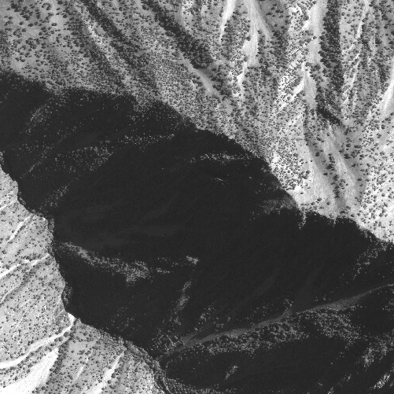
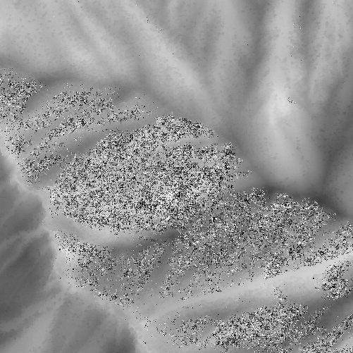
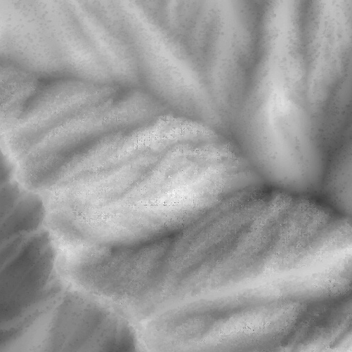
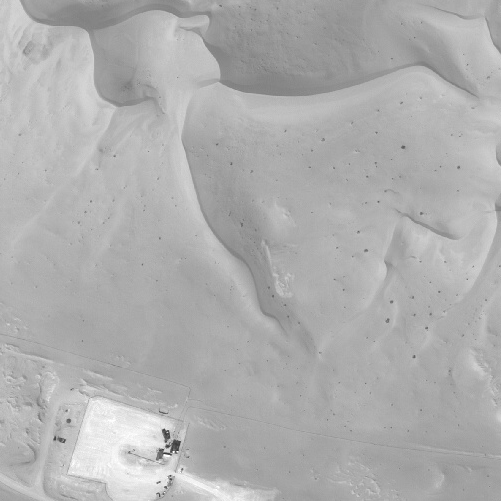
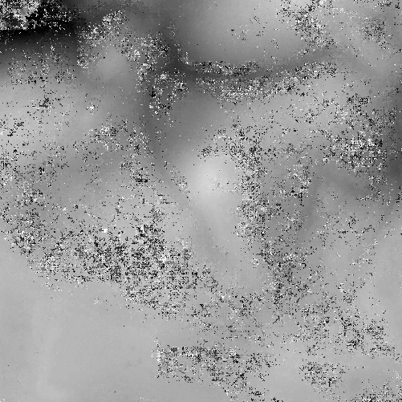
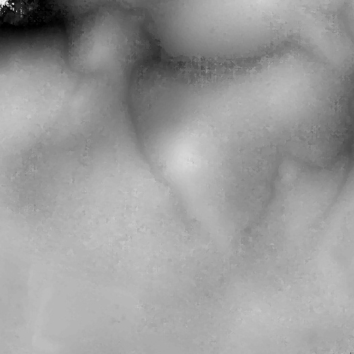

<h1 align="center"> Pandora plugin mccnn </h1>

<h4 align="center">MC-CNN neural network plugin for <a href="https://github.com/CNES/Pandora"></a>  .</h4>

<p align="center">
  <a href="https://github.com/CNES/Pandora_plugin_mccnn/actions"></a>
  <a href="https://opensource.org/licenses/Apache-2.0/"></a>
</p>

<p align="center">
  <a href="#overview">Overview</a> •
  <a href="#install">Install</a> •
    <a href="#usage">Usage</a> •
  <a href="#related">Related</a> •
  <a href="#references">References</a>
</p>

## Overview

[Pandora](https://github.com/CNES/Pandora) stereo matching framework is designed to provide some state of the art stereo algorithms and to add others one as plugins.  
This [Pandora plugin](https://pandora.readthedocs.io/en/stable/userguide/plugin.html) aims to compute the cost volume using the similarity measure produced by MC-CNN neural network [[MCCNN]](#MCCNN), with the [MCCNN](https://github.com/CNES/Pandora_MCCNN)  library .

## Install

**pandora_plugin_mccnn** is available on Pypi and can be installed by:

```bash
pip install pandora_plugin_mccnn
```

This command will installed required dependencies as [Pandora](https://github.com/CNES/Pandora) and [MCCNN](https://github.com/CNES/Pandora_MCCNN).

## Usage

Let's refer to [Pandora's readme](https://github.com/CNES/Pandora/blob/master/README.md) or [online documentation](https://pandora.readthedocs.io/?badge=latest) for further information about Pandora general functionalities. 

More specifically, you can find :
- [MCCNN configuration file example](https://raw.githubusercontent.com/CNES/Pandora/master/data_samples/json_conf_files/a_semi_global_matching_with_mccnn_similarity_measure.json)
- [documentation about MCCNN theory and parameters](https://pandora.readthedocs.io/en/stable/userguide/plugins/plugin_mccnn.html)


## Pretrained Weights for MCCNN networks

### Download weights files

Pretrained weights for mc-cnn fast and mc-cnn accurate neural networks are available in the weights directory :
-  mc_cnn_fast_mb_weights.pt and mc_cnn_accurate_mb_weights.pt are the weights of the pretrained networks on the Middlebury dataset [[Middlebury]](#Middlebury)
-  mc_cnn_fast_data_fusion_contest.pt and mc_cnn_accurate_data_fusion_contest.pt are the weights of the pretrained networks on the Data Fusion Contest dataset [[DFC]](#DFC)

To download the pretrained weights:

```bash
wget https://raw.githubusercontent.com/CNES/Pandora_MCCNN/master/mc_cnn/weights/mc_cnn_fast_mb_weights.pt
wget https://raw.githubusercontent.com/CNES/Pandora_MCCNN/master/mc_cnn/weights/mc_cnn_fast_data_fusion_contest.pt
wget https://raw.githubusercontent.com/CNES/Pandora_MCCNN/master/mc_cnn/weights/mc_cnn_accurate_mb_weights.pt
wget https://raw.githubusercontent.com/CNES/Pandora_MCCNN/master/mc_cnn/weights/mc_cnn_accurate_data_fusion_contest.pt
```

### Access weights from pip package

Pretrained weights are stored into the pip package and downloaded for any installation of mc_cnn pip package.
To access it, use the `weights` submodule :

```python
from mc_cnn.weights import get_weights
mc_cnn_fast_mb_weights_path = get_weights(arch="fast", training_dataset="middlebury")
mc_cnn_fast_data_fusion_contest_path = get_weights(arch="fast", training_dataset="dfc")
mc_cnn_accurate_mb_weights_path = get_weights(arch="accurate", training_dataset="middlebury")
mc_cnn_accurate_data_fusion_contest = get_weights(arch="accurate", training_dataset="dfc")
```

## Output example

The figures below show disparity maps produced on mountain, and desert areas generated with the Census and MCCNN similarity measures :

|                Left image                                                                  |        Left disparity map using Census measure                                             | Left disparity map using mc-cnn fast pretrained on Middlebury  | Left disparity map using mc-cnn fast pretrained DFC              |
| ------------------------------------------------------------------------------------------ | ------------------------------------------------------------------------------------------ | ---------------------------------------------------------------------- | ------------------------------------------------------------------------ |
|                                              |                                        |        | |
|                                                  |                                            |            |     |

## Related

[Pandora](https://github.com/CNES/Pandora) - A stereo matching framework  
[MCCNN](https://github.com/CNES/Pandora_MCCNN) - Pytorch/python implementation of mc-cnn neural network

## References

Please cite the following paper when using Pandora and pandora_plugin_mccnn:   

*Defonte, V., Dumas, L., Cournet, M., & Sarrazin, E. (2021, July). Evaluation of MC-CNN Based Stereo Matching Pipeline for the CO3D Earth Observation Program. In 2021 IEEE International Geoscience and Remote Sensing Symposium IGARSS (pp. 7670-7673). IEEE.*

*Cournet, M., Sarrazin, E., Dumas, L., Michel, J., Guinet, J., Youssefi, D., Defonte, V., Fardet, Q., 2020. Ground-truth generation and disparity estimation for optical satellite imagery. ISPRS - International Archives of the Photogrammetry, Remote Sensing and Spatial Information Sciences.*

<a id="MCCNN">[MCCNN]</a> 
*Zbontar, J., & LeCun, Y. (2016). Stereo matching by training a convolutional neural network to compare image patches. J. Mach. Learn. Res., 17(1), 2287-2318.*

<a id="Middlebury">[Middlebury]</a> 
*Scharstein, D., Hirschmüller, H., Kitajima, Y., Krathwohl, G., Nešić, N., Wang, X., & Westling, P. (2014, September). High-resolution stereo datasets with subpixel-accurate ground truth. In German conference on pattern recognition (pp. 31-42). Springer, Cham.*

<a id="DFC">[DFC]</a> 
*Bosch, M., Foster, K., Christie, G., Wang, S., Hager, G. D., & Brown, M. (2019, January). Semantic stereo for incidental satellite images. In 2019 IEEE Winter Conference on Applications of Computer Vision (WACV) (pp. 1524-1532). IEEE.*
